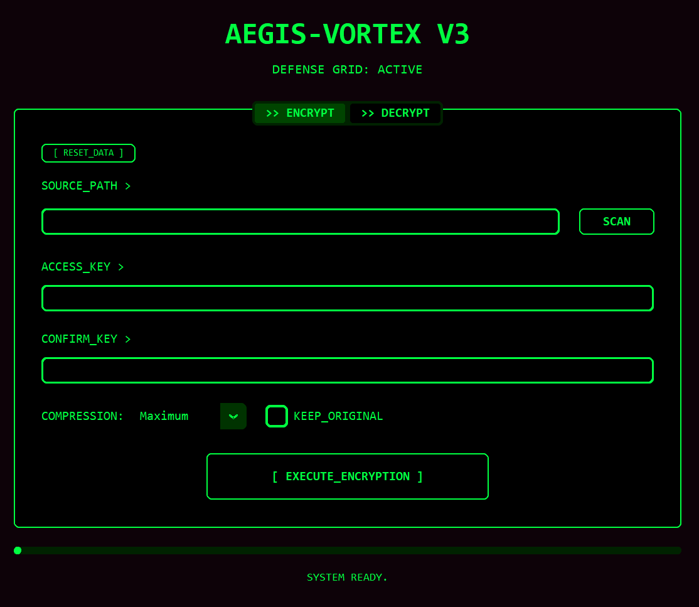
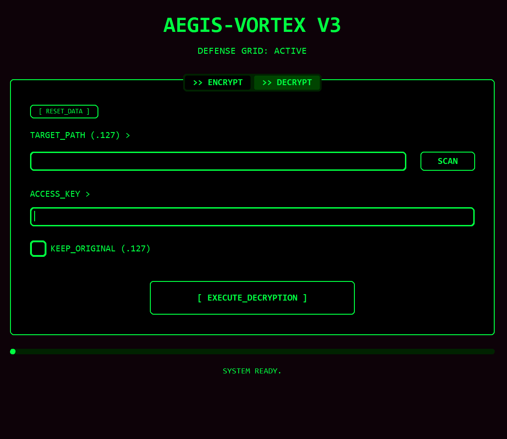

# 🛡️ AEGIS-VORTEX (V3.8) - "The Matrix Stability Edition" 🏎️⚡🟢

**AegisVortex** est une suite de sécurité binaire de pointe conçue pour le chiffrement et la compression ultra-rapide de données massives (Go/To). Alliant la robustesse d'un bouclier impénétrable à la vitesse d'un vortex, c'est l'outil ultime pour protéger vos fichiers sensibles sans perdre de temps.

---

## 🚀 Pourquoi choisir AegisVortex ?

### ⚡ Vitesse de Pointe (Turbo Engine)
Le moteur **Turbo V3.8** sature la bande passante de vos disques (SSD ou HDD). Capable d'atteindre des vitesses de déchiffrement de **+300 Mo/s**, AegisVortex transforme vos gigaoctets en archives sécurisées en quelques secondes.

### 🛡️ Protection Certifiée
- **Chiffrement Authentifié (AES-256 GCM) :** Chaque morceau de vos données est vérifié. S'il est modifié par un tiers, le logiciel le détecte instantanément.
- **Forteresse Argon2id :** Vos mots de passe sont protégés par le standard le plus élevé au monde, résistant aux attaques par supercalculateurs.
- **Résilience Totale :** En cas de corruption partielle du fichier, notre architecture par morceaux (Chunks) sauve le reste de vos données.

### 💎 Simplicité Absolue (Matrix UI)
Une interface immersive inspirée de Matrix, pensée pour l'efficacité :
- **Drag & Drop :** Glissez un dossier, tapez votre mot de passe, et c'est protégé.
- **100% Portable :** Copiez le dossier sur une clé USB et utilisez-le sur n'importe quel ordinateur Windows.

---

## 🖥️ Aperçu de l'Interface

*Interface principale de Chiffrement (Mode ENCRYPT)*

*Interface de Restauration (Mode DECRYPT)*

---

## 📖 Comment ça marche ? (Tuto)

### 🖱️ Drag & Drop (Glisser-Déposer)
Pour une efficacité maximale, ne copiez pas vos chemins à la main :
1. Prenez votre fichier ou dossier (peu importe s'il est déjà compressé ou non).
2. Glissez-le directement dans la zone **`SOURCE_PATH`** (onglet Encrypt) ou **`TARGET_PATH`** (onglet Decrypt).
3. Le logiciel détecte automatiquement s'il s'agit d'un dossier ou d'un fichier et prépare l'action.

### 🛡️ Options de Sécurité
- **[ RESET_DATA ] :** Ce bouton efface instantanément tous les champs (chemins et mots de passe). Utile pour "nettoyer" l'écran avant de quitter ou pour enchaîner plusieurs sessions.
- **KEEP_ORIGINAL :** 
  - **Coché (Par défaut) :** Conserve votre fichier d'origine après l'opération.
  - **Décoché :** Supprime automatiquement le fichier source une fois que l'action est réussie. *Idéal pour gagner de la place ou effacer les traces.*

### 🏎️ Les Modes de Compression
AegisVortex utilise l'algorithme surpuissant **Zstandard (Zstd)** :
- **RAPIDE :** (Niveau 1) Pour les dossiers massifs (To). Vitesse d'écriture maximale, compression légère.
- **ÉQUILIBRÉ :** (Niveau 3) Le standard. Excellent compromis entre taille de fichier et temps de calcul.
- **MAXIMUM :** (Niveau 19) Pour archiver à long terme. Compresse au maximum vos données, mais demande plus de temps et de processeur.

---

## 🛠️ Installation en 1 Clic

### 1️⃣ Prérequis
Vous avez juste besoin de **Python 3** installé sur votre PC. 

### 2️⃣ Lancement
**Aucune installation complexe requise.** 
1. Téléchargez ou copiez le dossier AegisVortex.
2. Double-cliquez sur **`start.bat`**.
3. C'est tout. Le logiciel prépare son propre environnement sécurisé automatiquement.

---

## ⚠️ AVERTISSEMENT CRITIQUE (DISCLAIMER)

> [!CAUTION]
> **PERTE DE MOT DE PASSE = PERTE DÉFINITIVE DES DONNÉES**
> AegisVortex utilise des standards de chiffrement de grade militaire. Contrairement aux services cloud classiques, il n'existe **aucune procédure de récupération de mot de passe**. 
> Si vous oubliez votre clé d'accès, vos fichiers sont mathématiquement perdus à jamais. L'auteur du logiciel décline toute responsabilité en cas de perte de données liée à l'oubli d'un mot de passe ou à une mauvaise manipulation.

---

## 📊 Puissance de Défense : Aegis vs Brute-Force

Grâce à l'algorithme **Argon2id**, AegisVortex est conçu pour résister aux attaques les plus massives :
- **Facteur Mémoire :** Chaque tentative de déchiffrement mobilise volontairement 64 Mo de RAM, rendant les attaques par GPU (cartes graphiques) inefficaces.
- **Statistique d'Invulnérabilité :** Pour forcer un mot de passe complexe de 12 caractères sur AegisVortex, il faudrait une puissance de calcul équivalente à **10 millions de PC gaming haut de gamme tournant 24h/24 pendant environ 1 500 ans**. 

*Votre vie privée n'est pas seulement protégée, elle est mathématiquement verrouillée dans le vide.*

---
